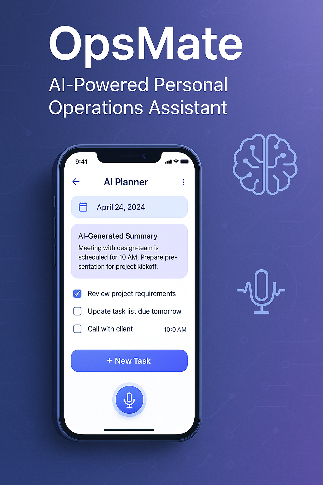

---

```markdown
# 📱 OpsMate – AI-Powered Personal Operations Assistant

**Your intelligent mobile sidekick for planning, task automation, and daily productivity — built with Flutter & AI.**

 <!-- You can replace this with your own screenshot/banner -->

---

## 🚀 Overview

**OpsMate** is a cross-platform Flutter mobile application designed to help professionals, freelancers, and remote workers manage their tasks, schedules, and operations intelligently using AI.

🧠 **AI Features**  
🎙️ **Voice to Task Automation**  
📅 **Smart Daily Planner**  
📌 **Offline & Private by Design**

This project showcases full-stack mobile engineering, clean Flutter architecture, and free-tier AI model integration (Mistral, Hugging Face, Whisper).

---

## 🔍 Key Features

| Feature                     | Description                                                        |
| --------------------------- | ------------------------------------------------------------------ |
| 🗣️ Voice Command Input      | Convert speech to structured task via `Whisper` or offline STT     |
| 🧠 AI-Powered Summarization | Convert long notes into concise summaries using Hugging Face LLM   |
| 📅 Smart Scheduling         | Automatically prioritize & reschedule tasks with Mistral/GPT logic |
| 📌 Task Categorization      | AI auto-sorts tasks (Work, Personal, Urgent)                       |
| 📂 Local Storage            | Fast & secure with Hive (no backend needed)                        |
| 🧑‍💼 Role-Specific Boards     | Supports Freelancer, Remote Employee, or Student modes             |
| 🔒 Offline-First            | Fully functional even without the internet                         |
| 📱 Clean Flutter UI         | Responsive and minimal with Custom Widgets and State Management    |

---

## 🧑‍💻 Tech Stack

- **Flutter 3+** (Cross-platform UI)
- **Whisper (offline)** – Speech-to-Text
- **Hugging Face / Mistral** – NLP summarization, classification, task generation
- **Hive / Drift** – Local storage
- **GetIt + Riverpod / Bloc** – State management
- **CI/CD** – GitHub Actions for build & lint

---

## 📦 Project Structure (Clean Architecture)

```

lib/
│
├── core/
│ ├── constants/
│ ├── services/ # AI API wrappers
│ ├── utils/
│
├── features/
│ ├── task/
│ │ ├── data/
│ │ ├── domain/
│ │ └── presentation/
│
├── shared/
│ ├── widgets/
│ └── extensions/
│
└── main.dart

```

---

## 📸 Screenshots

<!-- Replace with your actual screenshots -->

| Home Screen              | Voice to Task              | AI Planner                     |
| ------------------------ | -------------------------- | ------------------------------ |
|  |  |  |

---

## 🧪 Getting Started

### 📋 Prerequisites

- Flutter SDK: 3.13.x (via FVM)
- Dart: 3.1.x
- Gradle: 8.1
- Java: 17
- Git
- Optional: VS Code / Android Studio

### 🔧 Installation

```bash
git clone https://github.com/yourusername/OpsMate.git
cd OpsMate
flutter pub get
flutter run
```

> ⚠️ Whisper and AI APIs may require setup. See [`docs/ai_config.md`](docs/ai_config.md)

---

## 🧠 AI Configuration

| Model           | Task                      | Provider           | Free? | Docs Link                                   |
| --------------- | ------------------------- | ------------------ | ----- | ------------------------------------------- |
| Whisper (local) | Speech to Text            | Open-source        | ✅    | [GitHub](https://github.com/openai/whisper) |
| Mistral         | NLP (Summarize, Classify) | Self-host / Ollama | ✅    | [mistral.ai](https://mistral.ai)            |
| Hugging Face    | Summary, NER, etc.        | Inference API      | ✅    | [huggingface.co](https://huggingface.co)    |

---

## 📌 Roadmap

- [x] Flutter UI + Task Flow
- [x] Whisper STT Integration
- [x] Hugging Face summarizer integration
- [ ] Smart Planner (AI reordering)
- [ ] Firebase Auth (optional)
- [ ] Deploy Demo to Google Play (Public Build)

---

## 🧠 Use Cases

- Freelancers managing multiple clients
- Remote workers automating daily ops
- Students tracking studies, tasks, and notes
- Anyone who wants an AI-powered daily planner offline

---

## 🤝 Contributing

Pull requests are welcome! For major changes, open an issue first.

---

## 🧾 License

This project is licensed under the MIT License. See the [LICENSE](LICENSE) file for details.

---

## 🌐 Connect with Me

**Rahat** – _Full Stack & Flutter Developer | AI Enthusiast | Open to Remote Opportunities_

- GitHub: [@yourusername](https://github.com/Darahat)
- LinkedIn: [linkedin.com/in/yourprofile](https://linkedin.com/in/darahat)
- Email: [your.email@example.com](mailto:darahat42@gmail.com)

---

> ⭐ If you like this project, please star the repo and share it — it helps others discover and it motivates me to build more.

```

---

### ✅ Next Steps for You:

- Replace placeholder links (GitHub, LinkedIn, email)
- Add screenshots in `/assets` and reference them
- Create sub-docs like `docs/ai_config.md` if needed
- Push to GitHub with commits and a GitHub project board

```
